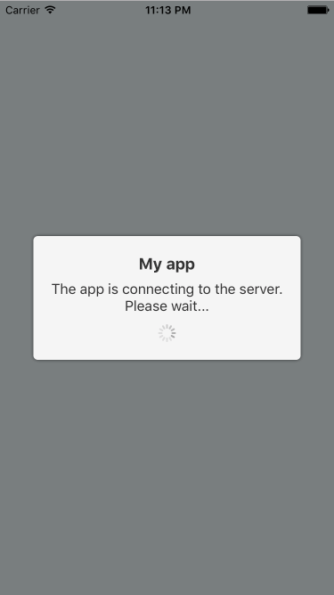
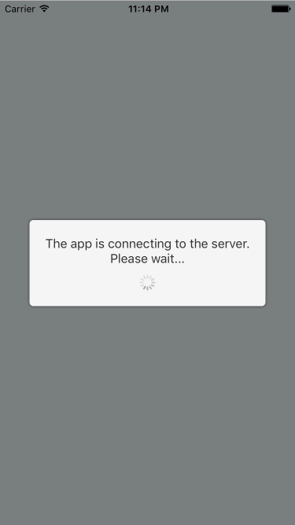
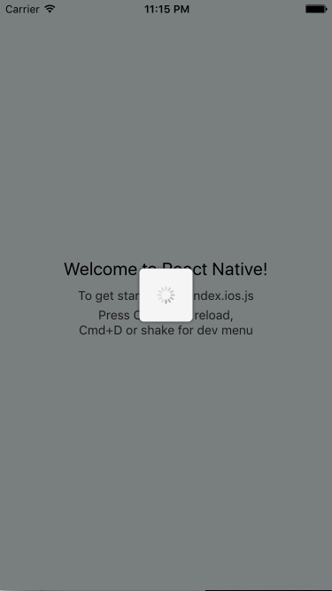
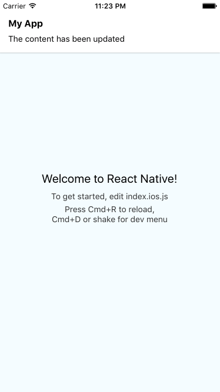
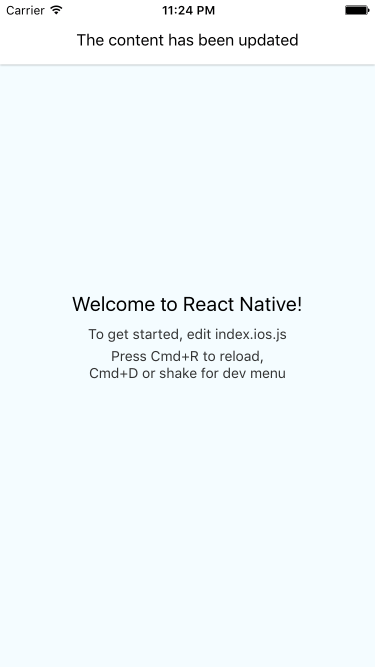
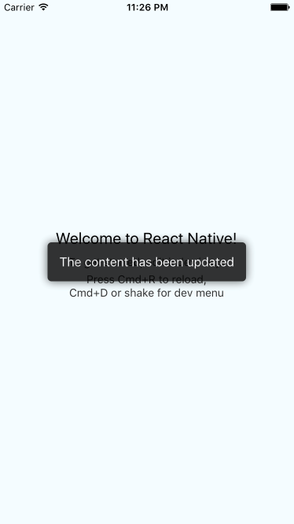

### React Native overlay messages

-----------------------

Pure Javascript solution to display message views in your app, independently of routing or modals.

This library allows you to display three kind of messages (toast, notification and loading indicator), one at a time. If many messages are queued, they will be displayed in order, once the previous ones are hidden.

* Toast and notifications will hide automatically after 5.5 seconds
* Loading indicators will not hide until you tell them to

## Usage

Install the package in your app project:

```bash
npm install react-native-overlay-messages
```

Then, anywhere in your source code, import the functions you need:

```javascript
import {
	showToast,
	showNotification,
	showLoading,
	hideLoading,
	hide
} from 'react-native-overlay-messages';
```

## Examples

### Loading

```javascript
showLoading("The content has been updated", "My App");

hideLoading(); // later on
```



```javascript
showLoading("The content has been updated");

hideLoading(); // later on
```



```javascript
var id = showLoading()

hideLoading(); // later on
```



### Notifications

```javascript
var id = showNotification("The content has been updated", "My App");
// var id = showNotification("The content has been updated", "My App", { duration: 10000, ... });

hide(id); // optional
```




```javascript
var id = showNotification("The content has been updated");
// var id = showNotification("The content has been updated", { duration: 10000, ... });

hide(id); // optional
```



### Toast

```
var id = showToast("The content has been updated");

hide(id); // optional
```


